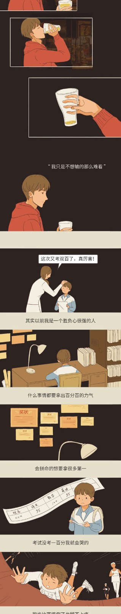

# 【Python】Python PIL实现多图拼接为长图

## 输入图像


...

## 输出图像


## 实现代码
```python
# coding=utf8
import os
import PIL
from PIL import ImageFile, Image


def connect(pics: list):
    ifs = [Image.open(fn) for fn in pics]
    width = 300
    height = 0
    for img in ifs:
        if width < img.size[0]:
            width = img.size[0]

        print(img, img.size)

    for img in ifs:
        # 图像放大率
        ratio = width/img.size[0]
        height = height + ratio*img.size[1]

    im = Image.new("RGB", (width, int(height)))
    y = 0
    for img in ifs:
        ratio = width/img.size[0]
        img_scaled = img.resize((width, int(ratio*img.size[1])))
        im.paste(img_scaled, (0, int(y)))
        y = y + img.size[1]*ratio
    im.save("output3.jpg")


# print( , " *size:", ifs[0].size)


if __name__ == "__main__":
    pics = [fn for fn in os.listdir(
        ".") if fn[0].isdigit() and fn.endswith(".jpg")]
    pics = ['1.jpg', '2.jpg', '3.jpg', '4.jpg',
            '5.jpg', '6.jpg', '7.jpg', '8.jpg']
    print(pics)
    connect(pics)

```